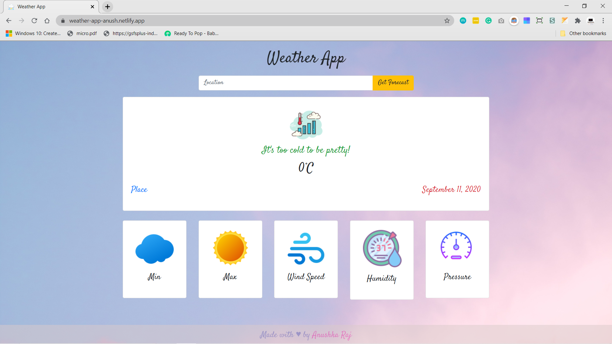
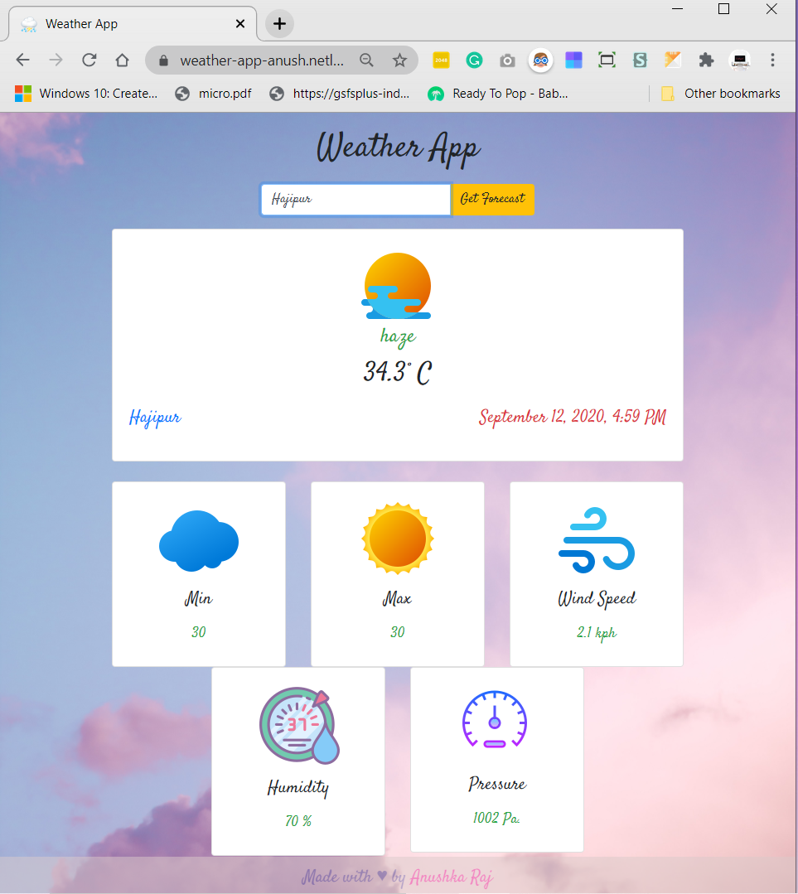

# 🌦️[Weather App](https://weather-app-anush.netlify.app/)

It displays real-time weather of any location. [OpenWeatherMap](https://openweathermap.org/api) API is used to access current weather data for any location.
## Stack: 
HTML, CSS, Javascript, Bootstrap4

Show some ❤️ by starring this repo.!

